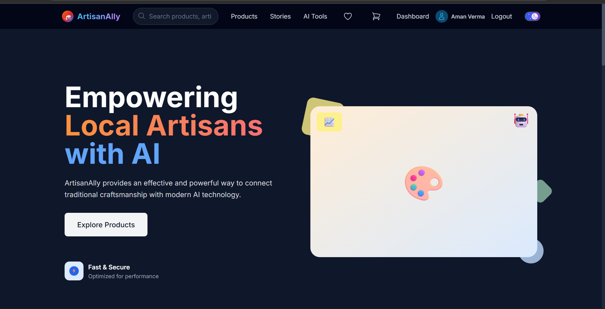
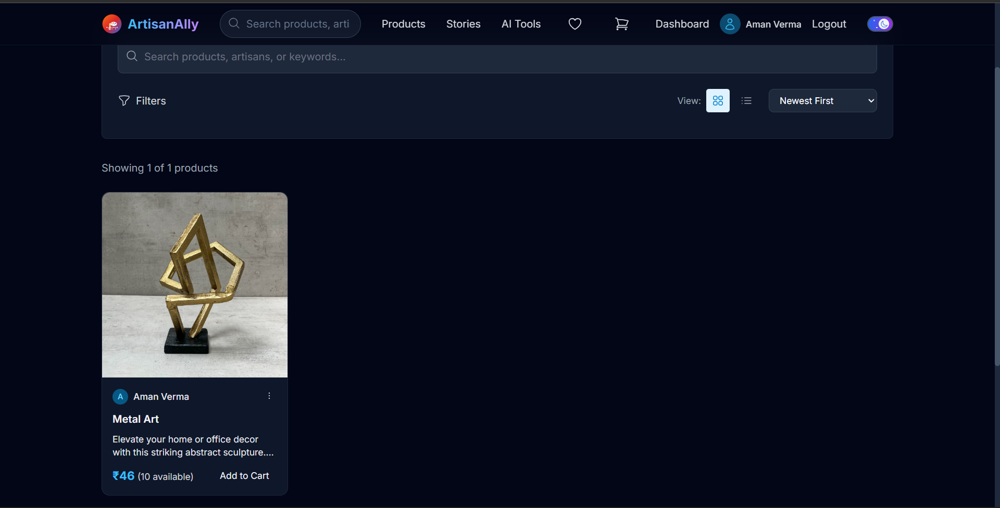
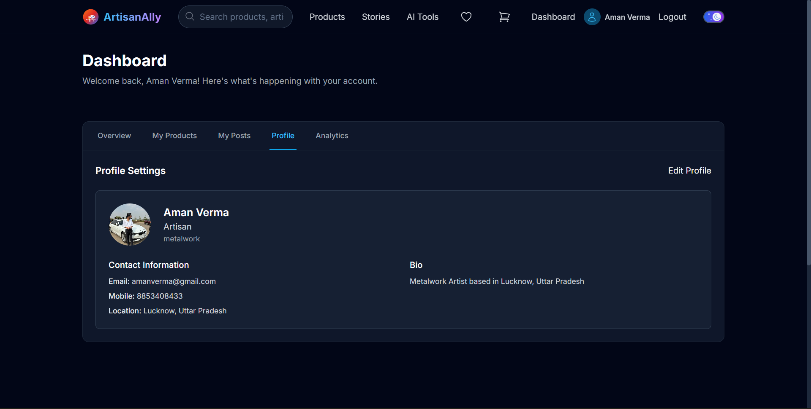
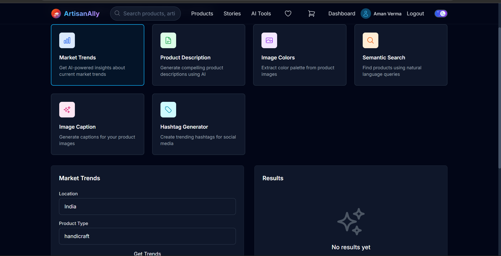

# ArtisanAlly

A full-stack platform connecting artisans with customers, featuring post creation, product marketplace, AI tools, and social features.

## Features

### 🎨 For Artisans
- **Create Posts**: Share your craft stories, techniques, and inspiration
- **Product Marketplace**: List and sell your handcrafted items
- **AI Tools**: Generate descriptions, captions, hashtags, and get recommendations
- **Dashboard**: Manage your products, orders, and analytics
- **Follow System**: Build a community around your craft

### 🛍️ For Customers
- **Browse Products**: Discover unique handcrafted items
- **Social Feed**: Read artisan stories and posts
- **Shopping Cart**: Add products and checkout with Stripe
- **AI Search**: Semantic search to find exactly what you're looking for
- **Follow Artisans**: Stay updated with your favorite creators

### 🤖 AI Features
- **Trend Analysis**: Get insights on popular crafts in your area
- **Caption Generation**: AI-generated captions for your posts
- **Product Descriptions**: Auto-generate compelling product descriptions
- **Hashtag Suggestions**: Relevant hashtags for better discoverability
- **Color Palette Extraction**: Extract colors from product images
- **Semantic Search**: Find products using natural language queries

## Tech Stack

### Backend
- **Node.js** with Express
- **MongoDB** with Mongoose
- **JWT** authentication
- **Passport.js** for OAuth (Google, GitHub)
- **Stripe** for payments
- **Cloudinary** for image storage
- **NodeMailer** for email notifications
- **OpenAI/HuggingFace** for AI features
- **LangChain** for AI orchestration

### Frontend
- **React 19** with TypeScript
- **Vite** for build tooling
- **TailwindCSS** for styling
- **Zustand** for state management
- **React Router** for navigation
- **Axios** for API calls
- **React Hot Toast** for notifications
- **Heroicons** for icons

## 🖥️ UI Preview
The screenshots below are captured from a **locally running instance** of **ArtisanAlly — A One-Stop Solution for Local Artisans**, showcasing the platform's marketplace experience, user dashboard, and AI-powered features.
They demonstrate how data flows seamlessly from backend services into a **user-friendly, production-grade frontend interface**.

---

### 🏠 Homepage — Discover Local Artisans
This is the **primary entry point** of the platform, designed to highlight local artisans and their handcrafted products.

Key capabilities shown:
- Featured artisans and curated products
- Category-based browsing
- Responsive, modern UI optimized for discovery
- Clear call-to-action for user onboarding and exploration



---

### 🛍️ Products — Marketplace & Listings
This view represents the **core marketplace experience**, where users browse and explore artisan products.

Key capabilities shown:
- Product listings with pricing and availability
- Detailed product cards with images and metadata
- Seamless navigation between products and artisans
- Scalable layout for future filtering and search



---

### 📊 User Dashboard — Profile & Activity Management
The user dashboard provides a **centralized interface** for managing account-level interactions.

Key capabilities shown:
- User profile and account overview
- Order history and saved items
- Wishlist and cart access
- Personalized experience based on user activity



---

### 🤖 AI Features — Smart Assistance for Users & Artisans
This section showcases **AI-powered capabilities** integrated into the platform to enhance usability and engagement.

Key capabilities shown:
- AI-assisted content or product insights
- Smart recommendations and summaries
- Integration with external AI providers via secure backend APIs
- Extensible design for future intelligent features



## Getting Started

### Prerequisites
- Node.js 18+ and npm
- MongoDB (local or cloud instance)
- Git

### Installation

1. **Clone the repository**
```bash
git clone <repository-url>
cd artisanAlly
```

2. **Backend Setup**
```bash
cd artisanAlly-backend
npm install
```

3. **Configure Environment Variables**
```bash
cp .env.example .env
```

Edit `.env` with your configuration:
```env
# Database
MONGO_URI=mongodb://localhost:27017/artisanally

# JWT
JWT_SECRET=your_super_secret_jwt_key_here

# Session
SESSION_SECRET=your_session_secret_here

# Cloudinary (for image uploads)
CLOUDINARY_CLOUD_NAME=your_cloud_name
CLOUDINARY_API_KEY=your_api_key
CLOUDINARY_API_SECRET=your_api_secret

# Email (NodeMailer)
EMAIL_USER=your_email@gmail.com
EMAIL_PASS=your_email_password_or_app_password

# OAuth (Optional)
GOOGLE_CLIENT_ID=your_google_client_id
GOOGLE_CLIENT_SECRET=your_google_client_secret
GITHUB_CLIENT_ID=your_github_client_id
GITHUB_CLIENT_SECRET=your_github_client_secret

# AI Configuration
AI_PROVIDER=openai
AI_API_KEY=your_openai_api_key
AI_MODEL=gpt-4o-mini
AI_BASE_URL=https://api.openai.com/v1

# Alternative: HuggingFace (Free)
# HF_API_KEY=your_huggingface_api_key
# HF_MODEL=mistralai/Mistral-7B-Instruct-v0.2

# Stripe (for payments)
STRIPE_SECRET_KEY=sk_test_your_stripe_secret_key
STRIPE_PUBLISHABLE_KEY=pk_test_your_stripe_publishable_key

# Server
PORT=5000
NODE_ENV=development
```

4. **Frontend Setup**
```bash
cd ../artisanAlly-frontend
npm install
```

### Running the Application

1. **Start the backend server** (from `artisanAlly-backend` directory):
```bash
npm run dev
```
Server will run on http://localhost:5000

2. **Start the frontend development server** (from `artisanAlly-frontend` directory):
```bash
npm run dev
```
Frontend will run on http://localhost:5174 (or next available port)

## API Endpoints

### Authentication
- `POST /api/auth/register` - User registration
- `POST /api/auth/login` - User login
- `GET /api/auth/me` - Get current user
- `POST /api/auth/logout` - Logout user
- `GET /api/auth/google` - Google OAuth
- `GET /api/auth/github` - GitHub OAuth

### Posts
- `GET /api/posts` - Get all posts
- `POST /api/posts` - Create post (auth required)
- `GET /api/posts/:id` - Get single post
- `PUT /api/posts/:id` - Update post (auth required)
- `DELETE /api/posts/:id` - Delete post (auth required)
- `POST /api/posts/:id/like` - Toggle like (auth required)
- `POST /api/posts/:id/comment` - Add comment (auth required)

### Products
- `GET /api/products` - Get all products
- `POST /api/products` - Create product (artisan only)
- `GET /api/products/:id` - Get single product
- `PUT /api/products/:id` - Update product (artisan only)
- `DELETE /api/products/:id` - Delete product (artisan only)
- `GET /api/products/artist/:id` - Get products by artist

### Cart & Orders
- `GET /api/cart` - Get user cart (auth required)
- `POST /api/cart/add` - Add to cart (auth required)
- `DELETE /api/cart/remove/:id` - Remove from cart (auth required)
- `POST /api/checkout/create` - Create Stripe checkout session (auth required)

### AI Features
- `GET /api/ai/trends` - Get trends analysis
- `POST /api/ai/caption` - Generate caption
- `POST /api/ai/description` - Generate product description
- `POST /api/ai/hashtags` - Generate hashtags
- `POST /api/ai/colors` - Extract color palette
- `POST /api/ai/search` - Semantic search

### User Management
- `GET /api/user/artisans` - Get all artisans
- `PUT /api/user/profile` - Update profile (auth required)
- `GET /api/user/search` - Search users (auth required)
- `POST /api/users/:id/follow` - Follow user (auth required)
- `POST /api/users/:id/unfollow` - Unfollow user (auth required)

## Project Structure

```
artisanAlly/
├── artisanAlly-backend/
│   ├── config/           # Database, passport, AI configuration
│   ├── controllers/      # Request handlers
│   ├── middlewares/      # Authentication, file upload, etc.
│   ├── models/           # MongoDB schemas
│   ├── routes/           # API route definitions
│   ├── utils/            # Utility functions
│   └── server.js         # Express app entry point
├── artisanAlly-frontend/
│   ├── src/
│   │   ├── components/   # Reusable React components
│   │   ├── pages/        # Page components
│   │   ├── stores/       # Zustand state management
│   │   ├── services/     # API service layer
│   │   ├── types/        # TypeScript type definitions
│   │   └── App.tsx       # Main App component
│   ├── public/           # Static assets
│   └── index.html        # HTML entry point
└── README.md
```

## User Roles

### Customer
- Browse products and posts
- Add items to cart and purchase
- Follow artisans
- Use AI search features

### Artisan
- All customer features
- Create and manage posts
- Create and manage products
- Access AI tools for content creation
- View analytics dashboard

## Features Status

✅ **Completed Features**:
- User authentication (JWT + OAuth)
- Post creation, viewing, likes, comments
- Product creation, viewing, management
- Shopping cart functionality
- AI integration (OpenAI/HuggingFace)
- Responsive UI with TailwindCSS
- Search and filtering
- Follow system

🚧 **In Progress**:
- Payment processing with Stripe
- Email notifications
- Advanced AI features
- Analytics dashboard

## Contributing

1. Fork the repository
2. Create a feature branch (`git checkout -b feature/amazing-feature`)
3. Commit your changes (`git commit -m 'Add some amazing feature'`)
4. Push to the branch (`git push origin feature/amazing-feature`)
5. Open a Pull Request

## License

This project is licensed under the MIT License - see the LICENSE file for details.

## Support

For support, email akverma1426@gmail.com or join our community Discord.
